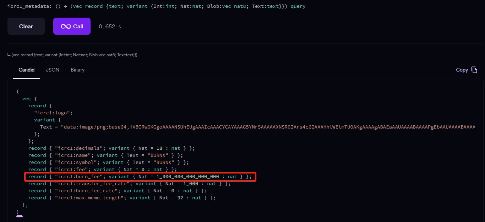
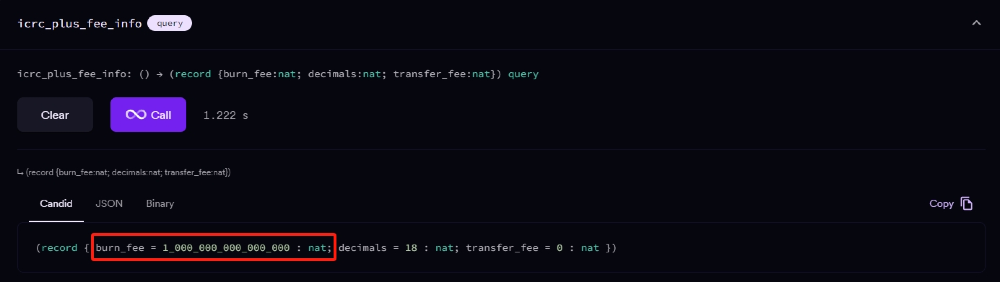
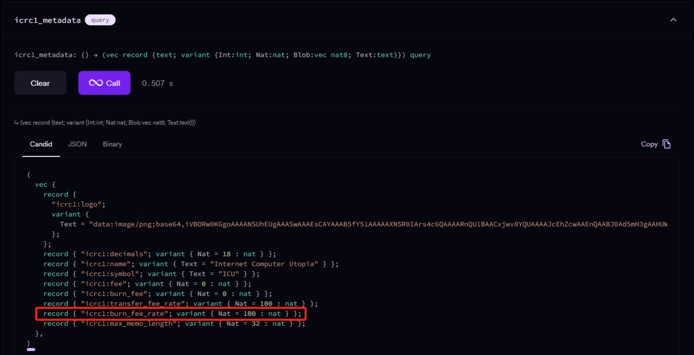
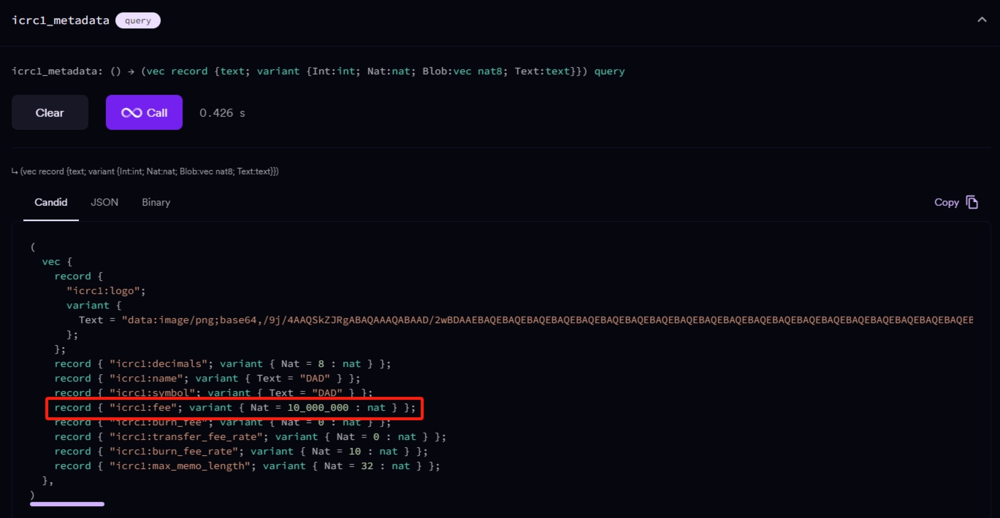
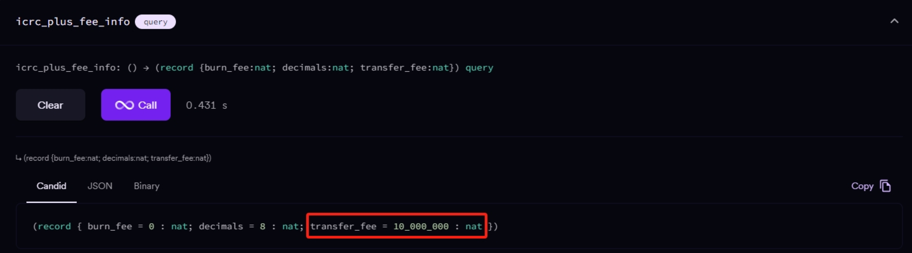
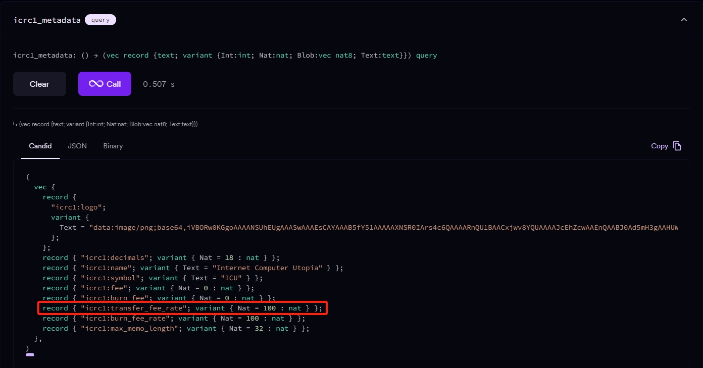
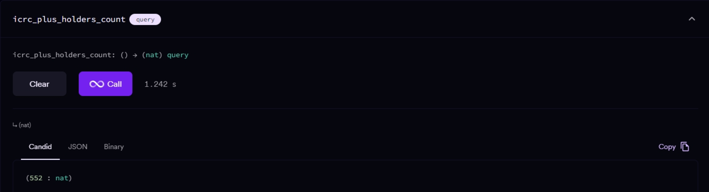
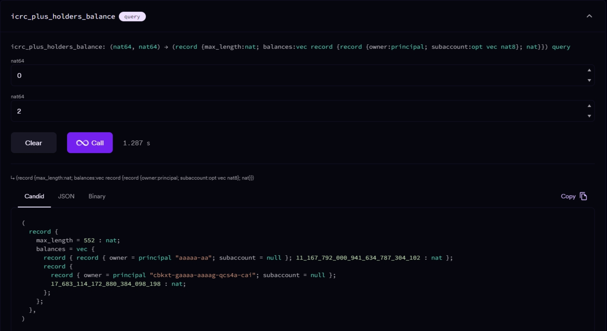
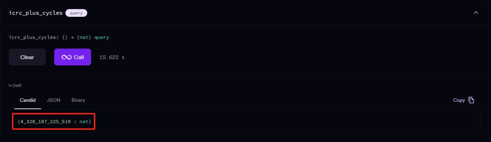
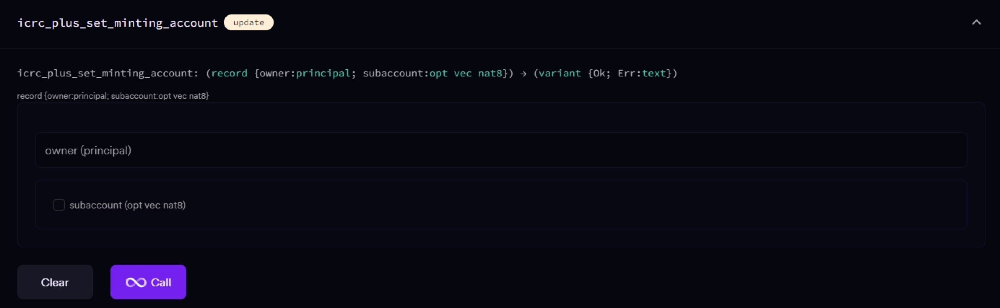

= ICRC-2 Plus Ledger

The ICRC-2+ protocol is an enhanced version of the ICRC-2 protocol developed by the ICPEx team. It aims to enrich the functions of the ICRC-2 protocol and make the ICRC-2 protocol more competitive with the token standards of other public chains. The ICRC-2+ protocol is compatible with both the ICRC-2 and ICRC-1 protocols. Users can import ICRC-2+ protocol tokens just like ICRC-2/ICRC-1 protocol tokens without any additional operations.

== New Features List
*1. Burn Fee*

A fixed amount or percentage of tokens will be sent to the burn address for each on-chain transfer.

*2. Transfer Fee*

A fixed amount or percentage of tokens will be sent to the creator's address for each on-chain transfer.

*3. Number of Token Holders*

Users can view the number of token holders of the ICRC-2 tokens.

*4. Distribution of Holdings*

Users can view the distribution of holdings of the ICRC-2 tokens.

*5. View the Amount of Cycles in the Token Canister*

Users can view the amount of cycles in the ICRC-2 token canister.

*6. Relinquish Ownership of the Token Canister*

The token creator can transfer ownership of the token canister to the black hole address(aaaaa_aa).


== Method Calling Guide
*1. Burn Fee Calculation*

Users can call the "icrc1_metadata" method to return the Burn Fee.

(1) Burn Fee in Fixed Amount Mode

After calling the "icrc1_metadata" method, check the return result of the "icrc1:burn_fee" field.

Example:

When this method of canister pbuvh-yiaaa-aaaam-acfpq-cai is called, the return value of the "icrc1:burn_fee" field is 1_000_000_000_000_000. Considering that its decimals is 18, the Burn Fee is 0.001. The details of the return result are shown in the figure below:



Or you can call the "icrc_plus_fee_info" method to check the return result of the "burn_fee" field, as shown below:



(2) Burn Fee in Percentage Mode

After calling the "icrc1_metadata" method, check the return result of the "icrc1:burn_fee_rate" field and divide by 10,000 to get the percentage rate.

Example:

When calling the method of canister o64gq-3qaaa-aaaam-acfla-cai, the method returns a burn_fee_rate value of 100, as shown below:



Therefore, the Burn Fee Rate is 100/10,000 = 1%.

*2. Transfer Fee Calculation*

Users can call the "icrc1_metadata" method to return the Transfer Fee.

(1) Transfer Fee in Fixed Amount Mode

After calling the "icrc1_metadata" method, check the return result of the "icrc1:fee" field.

Example:

When the method of canister zuwx2-fyaaa-aaaam-ack3q-cai is called, the return value of the "icrc1:fee" field is 10_000_000. Considering that its decimals is 8, the Transfer Fee is 0.1. The details of the return result are shown in the figure below:



Or you can call the "icrc_plus_fee_info" method to check the return result of the "transfer_fee" field, as shown below:



(2)Transfer Fee in Percentage Mode

After calling the "icrc1_metadata" method, check the return result of the "icrc1:transfer_fee_rate" field and divide by 10,000 to get the percentage rate.

Example:

When calling the method of canister o64gq-3qaaa-aaaam-acfla-cai, the method returns a "transfer_fee_rate" value of 100, as shown below:



Therefore, the Transfer Fee Rate is 100/10,000 = 1%.

*3.Number of Token Holders*

Users can call the "icrc_plus_holders_count" method to return the result.

Example:

When calling the method of canister o64gq-3qaaa-aaaam-acfla-cai, the returned value is the number of token holders, as shown below:



*4.Distribution of Holdings*

Users can call the "icrc_plus_holders_balance" method to return the result.

Parameter 1 is the starting index.

Parameter 2 is the number of records to query.

Example:

When calling the method of canister o64gq-3qaaa-aaaam-acfla-cai with Parameter 1 as 0 and Parameter 2 as 2 (i.e., querying 2 records starting from index 0), the method returns the result as shown below:



*5.Amount of Cycles of Canister*

Users can call the "icrc_plus_cycles" method to return the result.

Example:

When calling this method of canister o64gq-3qaaa-aaaam-acfla-cai, the method returns a value of 4_328_187_225_519, which is the number of cycles remaining for the canister. As shown below:



*6.Relinquish Ownership of the Token Canister*

Token creators can call the "icrc_plus_set_minting_account" method through a platform that has integrated the ICRC-2+ protocol to transfer the ownership of the token canister to the black hole address(aaaaa_aa).

The method is shown below.



== Code building guide
Generate did and wasm files using the following instructions.
```shell
sh build.sh
```


